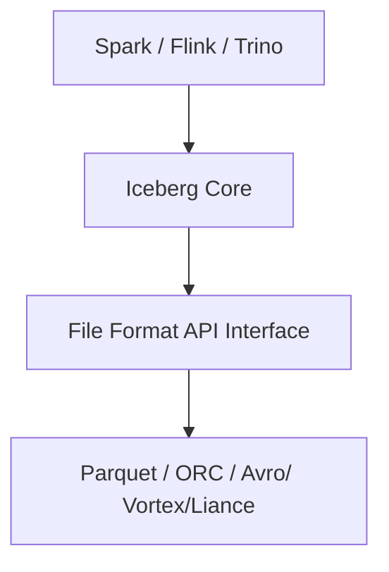

# Apache Iceberg 1.11.0: A Major Step Forward for the Open Lakehouse Ecosystem

## Collab          
1. [Ankita Hatibaruah](https://github.com/Ahb98), [LinkedIn](http://linkedin.com/in/ankita-hatibaruah-bb2a62218)
2. [Prashant Jha](https://github.com/PrashantJha29), [LinkedIn](https://www.linkedin.com/in/prashantjha29/)


## Overview

On May 19, 2026, Apache Iceberg officially released version 1.11.0, bringing major architectural enhancements, advanced data type support, improved delete handling, and powerful upgrades for modern data lakehouse workloads.

For data engineers and organizations building scalable lakehouse platforms, this release strengthens Iceberg’s position as the leading open table format for analytics, AI, streaming, and multi-engine interoperability.

## TL;DR
Apache Iceberg 1.11.0 is a major step forward for the open lakehouse ecosystem, introducing powerful features such as the new File Format API, Deletion Vectors, Variant data type, native geospatial support, and nanosecond timestamp precision. These enhancements improve scalability, query performance, semi-structured data handling, and multi-engine interoperability across platforms like Apache Spark, Flink, Trino, and Palantir Technologies Foundry, making Iceberg more future-ready for AI, streaming, and large-scale analytics workloads.

# What is Apache Iceberg?

Apache Iceberg is an open table format designed for huge analytic datasets. It provides:

- ACID transactions
- Schema evolution
- Partition evolution
- Time travel
- Concurrent writes
- Hidden partitioning
- Multi-engine compatibility

Iceberg is widely used with:

- Apache Spark
- Flink
- Trino
- Snowflake
- Dremio
- Databricks
- AWS Athena
- Palantir Foundry

Instead of managing raw Parquet files manually, Iceberg adds a metadata layer that makes large-scale data lakes behave more like reliable database tables.

# Major Features Introduced in Iceberg 1.11.0
## New File Format API in Apache Iceberg 1.11
Modern data platforms are evolving rapidly, and organizations are no longer limited to a single processing engine or storage optimization strategy. With the release of Apache Iceberg 1.11, one of the most significant architectural improvements introduced is the New File Format API.
This enhancement makes Iceberg more modular, extensible, and future-ready for next-generation analytics workloads.

Before Iceberg 1.11, support for file formats such as Parquet, ORC, Avro was tightly coupled with the internal engine implementations.

This approach worked well initially, but it introduced several challenges:

Adding new file formats required deeper code changes
- Storage logic was less modular
- Engine-specific implementations became harder to maintain
- innovation around emerging storage formats was slower
As the lakehouse ecosystem expanded, this became a scalability and maintainability concern.

### What changed in Iceberg 1.11?

Iceberg 1.11 introduces a dedicated File Format API, creating a clean abstraction layer between Iceberg metadata management and physical file format implementations.


The community is actively working on integrating Vortex as the first new pluggable format to ship through the File Format API. Vortex is designed for high-performance analytics: it supports direct GPU decompression, efficient filter expressions evaluated on compressed data, and a modular column encoding system that can match or exceed Parquet's performance on analytical workloads.

Lance, built specifically for AI-native workloads, offers high-performance random access to high-dimensional vector data. Its current home is the LanceDB ecosystem, but the File Format API makes future Iceberg integration experiments viable in a way they weren't before.

Nimble targets ML training pipelines that consume very wide tables with thousands of feature columns. It prioritizes fast decoding speed over compression ratio, which is the right tradeoff for training jobs that read the same features repeatedly.

This architectural change provides several major benefits:
- Better Extensibility
- Improved Modularity
- Stronger Multi-Engine Support
- Future-Proof Architecture


## Deletion Vectors
### Problem in Iceberg V2: 
In Iceberg V2, row-level deletes are handled using positional delete files.
Whenever a row is deleted or updated, Iceberg creates a separate delete file containing:
- Data file reference
- Row positions to delete

Over time, these delete files keep increasing. During query execution, the engine must open:
- the data file
- all associated delete files
This causes slower reads and higher metadata overhead.

Example
Suppose a data file contains:
| Position | Customer |
|----------|----------|
| 0 | A |
| 1 | B |
| 2 | C |
| 3 | D |

If rows at positions 1 and 3 are deleted at different times:
- Delete file 1 → position 1
- Delete file 2 → position 3

Now every read must:
- Read the data file.
- Read both delete files
- Apply deletions
   
As delete operations increase, delete files accumulate and query performance degrades.

### Deletion Vectors: Solving the Delete File Accumulation Problem
Iceberg 1.11 introduces Deletion Vectors (DV) in the V3 specification.
Instead of creating many positional delete files like in V2, Iceberg maintains a single deletion vector for each data file.
Iceberg V3 has:
- One data file
- One Puffin file containing the deletion vector
  
This creates a 1:1 mapping between:
Data File <-> Deletion Vector

How Deletion Vectors Work:
Deletion vectors store deleted row positions using a Roaring Bitmap inside a Puffin file. Roaring Bitmaps efficiently store deleted row positions using:
- Arrays (few deletes)
- Bitmaps (many deletes)
- RLE/Runs (consecutive deletes)

Example: Same data file
| Position | Customer |
|----------|----------|
| 0 | A |
| 1 | B |
| 2 | C |
| 3 | D |

Suppose, rows 1 and 3 are deleted. Conceptually the deletion vector stores [1, 3] using a Roaring Bitmap.

During query execution:
- Iceberg reads the data file
- Reads the deletion vector bitmap
- Skips deleted rows
	
Returned result:
| Position | Customer |
|----------|----------|
| 0 | A |
| 2 | C |

Benefits of Deletion Vector:
- No delete file accumulation 
- Query engine only needs:
  - Data file
  - Single bitmap file.  
  - instead of opening many delete files hence faster reads. 
- Better scalability 
- Reduced metadata overhead.


## Variant Data Type in Apache Iceberg 1.11
One of the most important additions in Apache Iceberg 1.11 is support for the Variant Data Type, which improves handling of semi-structured data.

This feature is especially useful for modern analytics systems that work with JSON, nested objects, dynamic schemas, event data, API responses
Earlier, many systems stored JSON as plain strings. This caused several problems:

- slow querying
- difficult parsing
- inefficient storage
- poor schema evolution
- limited optimization

Query engines had to repeatedly parse JSON strings during execution.
The new Variant type allows Iceberg to store semi-structured data natively instead of treating it as raw text.

Example:
```bash

CREATE TABLE events (
    id BIGINT,
    name VARIANT
)
USING iceberg;

```

The Variant type stores semi-structured data in a binary encoding that is more compact than JSON strings and supports predicate pushdown directly into the structure. The engine can evaluate a filter like variant_column['region'] = 'US-West' without parsing the full document for every row.

Schema flexibility is preserved. We don't need to define the shape of the data at table creation time. Variant accommodates evolving structures, optional fields, and nested documents.


## Native Geospatial Support in Apache Iceberg 1.11

Apache Iceberg 1.11 introduces native support for geospatial data types such as:
- GEOMETRY -> handles planar (flat-earth) spatial data.
- GEOGRAPHY -> handles spherical (curved-earth) spatial data.
This allows Iceberg tables to efficiently store and process location-based data directly within the lakehouse architecture.

Earlier, geospatial data was often stored as plain text, JSON, custom binary formats which made querying and analytics difficult.
With native geospatial support, Iceberg can now handle spatial data more efficiently and consistently across multiple engines.

This feature is useful for:

- maps and navigation systems
- logistics and route optimization
- telecom network analysis
- IoT and sensor tracking
- location-based analytics

```bash
CREATE TABLE locations (
    id BIGINT,
    region GEOGRAPHY
)
USING iceberg;
```
Teams running GIS workloads, location analytics, ride-sharing platform analysis, or geofencing operations can now store spatial data in Iceberg tables without custom format extensions or string workarounds. The same Iceberg table, governed by the same Polaris catalog, accessed by the same compute engines, can hold both structured analytics data and spatial geometry data with type-aware query support.


## Nanosecond Timestamps: Precision for High-Frequency Workloads
Apache Iceberg 1.11 introduces native nanosecond timestamp support using two new V3 data types: timestamp_ns(without timezone) and timestamptz_ns (with UTC timezone). Earlier Iceberg versions only supported microsecond precision, which caused precision loss in high-frequency workloads where events occur within nanoseconds. For example, timestamps like 10:15:30.123456100 and 10:15:30.123456200 were both rounded to 10:15:30.123456, resulting in loss of exact event ordering.

This enhancement is important for systems such as high-frequency trading platforms, scientific experiments, IoT sensors, and particle physics detectors, where nanosecond-level accuracy is critical. By supporting nanosecond timestamps natively, Iceberg preserves full timestamp semantics, timezone handling, and accurate event sequencing without relying on raw integer workarounds.

# Iceberg in Palantir Foundry

Although Apache Iceberg 1.11 introduces several major capabilities at the framework level, availability inside Palantir Foundry depends on the Iceberg version currently supported by Foundry and the platform’s feature rollout timeline. As a result, some Iceberg 1.11 features may not yet be fully available in Foundry.

Palantir Foundry supports Apache Iceberg tables as a modern alternative to traditional Foundry datasets, enabling more open, interoperable, and scalable lakehouse architectures. Foundry provides support for both managed Iceberg tables and externally managed Iceberg tables through catalog integrations.

In addition, Foundry implements the Iceberg REST Catalog specification, allowing external compute engines and services to interact with Iceberg tables using standardized APIs. This improves interoperability across the broader data ecosystem and enables integration with engines such as Apache Spark, Trino, Flink, and other Iceberg-compatible platforms.


## Benefits of Iceberg in Foundry

### 1. Better interoperability

Iceberg tables use an open standard. That means external tools can work with them more easily.

Example:

- Spark
- Databricks
- Snowflake
- Trino

can all read/write Iceberg tables more naturally.

### 2. Better Compaction

Over time, data tables create many small files. Compaction combines them into fewer larger files for better performance.

Iceberg can do this automatically without interrupting incremental reads.

### 3. Row-Level Edits

Iceberg supports:
- DELETE
- UPDATE
- MERGE INTO

So you can modify specific rows directly.

Without Iceberg: You might need to rewrite the entire dataset.

With Iceberg: You can update only the rows that changed.

Example:
```bash

UPDATE customers
SET status = 'inactive'
WHERE last_login < '2022-01-01'
```

### 4. Changelogs

Iceberg can track:

- inserted rows,
- updated rows,
- deleted rows.

This allows incremental processing, meaning instead of rereading the whole table, systems can process only changes.

### 5. Better history tracking

Iceberg keeps richer metadata/history.

One can see:

- table versions,
- schema changes,
- snapshots,
- updates over time.


## Differences Between Iceberg Tables and Foundry Datasets

### 1. Default Branch Naming

Apache Iceberg uses main as the default branch name, whereas Foundry traditionally uses master. Within Foundry’s Iceberg integration, these branch names are mapped equivalently. As a result, a Foundry job executing against the master branch will transparently write to the Iceberg table’s main branch.

This compatibility layer ensures interoperability between Foundry-native workflows and Iceberg-compliant tooling without requiring branch reconfiguration.

### 2. Automatic schema evolution

Schema evolution in Iceberg tables is not universally automatic. Depending on the workflow, schema updates may either be applied automatically or require explicit modification commands.

For example:

Full table replacement workflows typically evolve the schema automatically.
Incremental or append-based workflows may require explicit schema evolution operations, such as: ALTER TABLE to add, modify, or remove columns.

When using Foundry Transforms APIs or Pipeline Builder in non-incremental mode, Foundry generally performs table replacement operations behind the scenes, allowing schema changes to be handled automatically. However, incremental schema evolution scenarios can still fail if incoming data does not match the existing table schema. In such cases, manual intervention may be required to reconcile schema differences before processing can continue. This behavior reflects Iceberg’s emphasis on explicit and controlled schema management, particularly in distributed and multi-engine environments.

## Current Limitations in Foundry

Iceberg support in Foundry is still in Beta, and some features are not yet fully supported, including:

* Views
* Restricted views
* Streaming
* Lightweight Pipeline Builder pipelines
* Some advanced external engine integrations

Additionally, Foundry may not yet support all Iceberg 1.11 features immediately after release.


## Using Iceberg in Foundry

Generating a simple Iceberg table: using Polars
```bash
import polars as pl
from transforms.api import transform
from transforms.tables import IcebergOutput, TableOutput


@transform.using(
    output=TableOutput("/.../Output")
)
def compute(output: IcebergOutput):
    df_custom = pl.DataFrame({"phrase": ["Hello", "World"]})
    output.write_table(df_custom)
```
Generating an Iceberg table output using Iceberg table input
```bash
import polars as pl
from transforms.api import transform
from transforms.tables import IcebergInput, IcebergOutput, TableInput, TableOutput


@transform.using(
    source_table=TableInput("/.../Input"),
    output_table=TableOutput("/.../Output")
)
def compute(source_table: IcebergInput, output_table: IcebergOutput):
    output_table.write_table(source_table.polars())
```

Using Apache Iceberg with PySpark:
```bash
from pyspark.sql import SparkSession

# Create Spark Session with Iceberg support
spark = SparkSession.builder \
    .appName("IcebergExample") \
    .config(
        "spark.sql.extensions",
        "org.apache.iceberg.spark.extensions.IcebergSparkSessionExtensions"
    ) \
    .config(
        "spark.sql.catalog.demo",
        "org.apache.iceberg.spark.SparkCatalog"
    ) \
    .config(
        "spark.sql.catalog.demo.type",
        "hadoop"
    ) \
    .config(
        "spark.sql.catalog.demo.warehouse",
        "/tmp/iceberg-warehouse"
    ) \
    .getOrCreate()

# Sample Data
data = [
    (1, "Jack", "NZ"),
    (2, "John", "UK"),
    (3, "Alice", "USA")
]

columns = ["id", "name", "country"]

df = spark.createDataFrame(data, columns)

# Create Iceberg Table
df.writeTo("demo.db.customers").createOrReplace()

# Read Iceberg Table
result = spark.read.table("demo.db.customers")

# Show Data
result.show()
```

### Advanced PyIceberg Native Scans in Palantir Foundry:

While working with Apache Iceberg tables in Foundry, the standard IcebergInput and IcebergOutput APIs provide a simplified way to read and write data. These high-level APIs are convenient for most pipelines because they automatically load the current snapshot of the table.
However, these streamlined methods typically materialize the full dataset into memory and expose only limited optimization capabilities.
For advanced use cases, Foundry allows direct access to the underlying PyIceberg scan API using the .table() method.
This enables fine-grained control over:

- predicate pushdown
- column projection
- snapshot selection
- scan limits
- optimized reads

```bash
from pyiceberg.expressions import And, EqualTo, GreaterThan
from transforms.api import transform
from transforms.tables import IcebergInput, IcebergOutput, TableInput, TableOutput

@transform.using(
    source_table=TableInput("/.../Input"),
    output_table=TableOutput("/.../Output"),
)
def compute(source_table: IcebergInput, output_table: IcebergOutput):
    iceberg_table = source_table.table()

    scan = iceberg_table.scan(
        row_filter=And(
            EqualTo("region", "EMEA"),
            GreaterThan("score", 0.5),
        ),
        selected_fields=("customer_id", "score", "region"),
        limit=10_000,
    )
    output_table.write_table(scan.to_polars())
```


## Conclusion

Apache Iceberg 1.11 represents a major advancement for the open lakehouse ecosystem. Features such as deletion vectors, nanosecond timestamps, variant types, and the new File Format API improve performance, flexibility, and scalability for modern analytics workloads.

Palantir Foundry’s adoption of Iceberg positions it strongly for future lakehouse and AI-native architectures. Even if Foundry does not yet fully support every Iceberg 1.11 capability, many of the improvements align closely with Foundry’s direction toward interoperable, scalable, and enterprise-grade data platforms.

As adoption of open table formats continues to grow, Iceberg is becoming a foundational technology for the future of large-scale analytics and AI systems.
