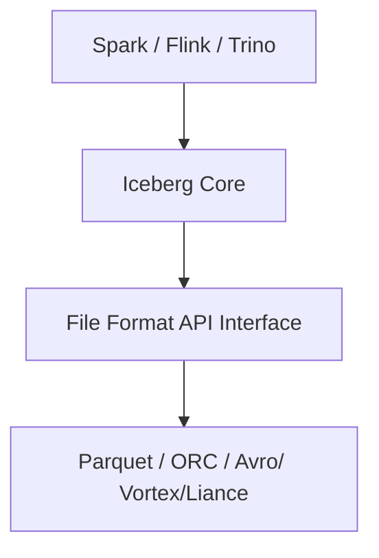

## New File Format API in Apache Iceberg 1.11
Modern data platforms are evolving rapidly, and organizations are no longer limited to a single processing engine or storage optimization strategy. With the release of Apache Iceberg 1.11, one of the most significant architectural improvements introduced is the New File Format API.
This enhancement makes Iceberg more modular, extensible, and future-ready for next-generation analytics workloads.

Before Iceberg 1.11, support for file formats such as Parquet, ORC, Avro was tightly coupled with the internal engine implementations.

This approach worked well initially, but it introduced several challenges:

Adding new file formats required deeper code changes
- Storage logic was less modular
- Engine-specific implementations became harder to maintain
- innovation around emerging storage formats was slower
As the lakehouse ecosystem expanded, this became a scalability and maintainability concern.

### What changed in Iceberg 1.11?

Iceberg 1.11 introduces a dedicated File Format API, creating a clean abstraction layer between Iceberg metadata management and physical file format implementations.


The community is actively working on integrating Vortex as the first new pluggable format to ship through the File Format API. Vortex is designed for high-performance analytics: it supports direct GPU decompression, efficient filter expressions evaluated on compressed data, and a modular column encoding system that can match or exceed Parquet's performance on analytical workloads.

Lance, built specifically for AI-native workloads, offers high-performance random access to high-dimensional vector data. Its current home is the LanceDB ecosystem, but the File Format API makes future Iceberg integration experiments viable in a way they weren't before.

Nimble targets ML training pipelines that consume very wide tables with thousands of feature columns. It prioritizes fast decoding speed over compression ratio, which is the right tradeoff for training jobs that read the same features repeatedly.

This architectural change provides several major benefits:
- Better Extensibility
- Improved Modularity
- Stronger Multi-Engine Support
- Future-Proof Architecture

## Deletion Vectors
### Problem in Iceberg V2
In Iceberg V2, row-level deletes are handled using positional delete files.
Whenever a row is deleted or updated, Iceberg creates a separate delete file containing:
- Data file reference
- Row positions to delete

Over time, these delete files keep increasing. During query execution, the engine must open:
- the data file
- all associated delete files
This causes slower reads and higher metadata overhead.

Example
Suppose a data file contains:

## Variant Data Type in Apache Iceberg 1.11
One of the most important additions in Apache Iceberg 1.11 is support for the Variant Data Type, which improves handling of semi-structured data.

This feature is especially useful for modern analytics systems that work with JSON, nested objects, dynamic schemas, event data, API responses
Earlier, many systems stored JSON as plain strings. This caused several problems:

- slow querying
- difficult parsing
- inefficient storage
- poor schema evolution
- limited optimization

Query engines had to repeatedly parse JSON strings during execution.
The new Variant type allows Iceberg to store semi-structured data natively instead of treating it as raw text.

Example:
```bash

CREATE TABLE events (
    id BIGINT,
    name VARIANT
)
USING iceberg;

```

The Variant type stores semi-structured data in a binary encoding that is more compact than JSON strings and supports predicate pushdown directly into the structure. The engine can evaluate a filter like variant_column['region'] = 'US-West' without parsing the full document for every row.

Schema flexibility is preserved. We don't need to define the shape of the data at table creation time. Variant accommodates evolving structures, optional fields, and nested documents.

## Native Geospatial Support in Apache Iceberg 1.11

Apache Iceberg 1.11 introduces native support for geospatial data types such as:
- GEOMETRY -> handles planar (flat-earth) spatial data.
- GEOGRAPHY -> handles spherical (curved-earth) spatial data.
This allows Iceberg tables to efficiently store and process location-based data directly within the lakehouse architecture.

Earlier, geospatial data was often stored as plain text, JSON, custom binary formats which made querying and analytics difficult.
With native geospatial support, Iceberg can now handle spatial data more efficiently and consistently across multiple engines.

This feature is useful for:

- maps and navigation systems
- logistics and route optimization
- telecom network analysis
- IoT and sensor tracking
- location-based analytics

```bash
CREATE TABLE locations (
    id BIGINT,
    region GEOGRAPHY
)
USING iceberg;
```
Teams running GIS workloads, location analytics, ride-sharing platform analysis, or geofencing operations can now store spatial data in Iceberg tables without custom format extensions or string workarounds. The same Iceberg table, governed by the same Polaris catalog, accessed by the same compute engines, can hold both structured analytics data and spatial geometry data with type-aware query support.
